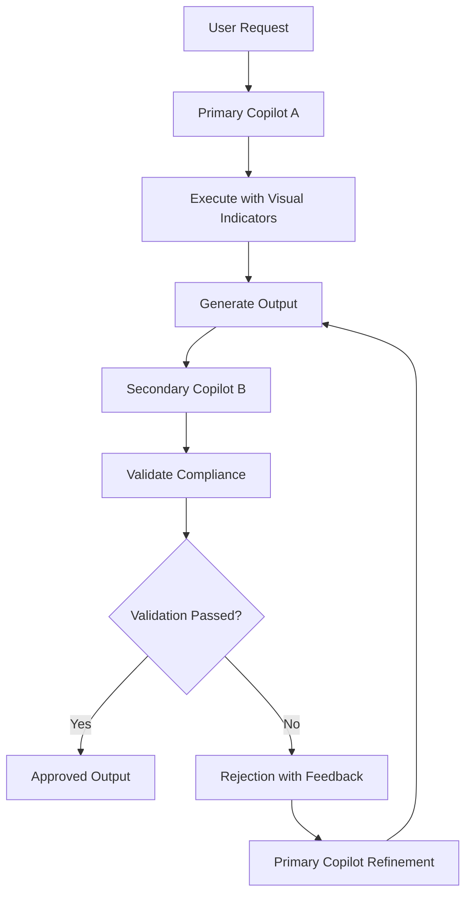

# 🤖🤖 DUAL COPILOT PATTERN - Enterprise AI Validation Framework
## Self-Monitoring GitHub Copilot Architecture for gh_COPILOT Toolkit

### 🎯 **PATTERN OVERVIEW**

**DUAL COPILOT PATTERN:** A revolutionary approach where two GitHub Copilot instances work in tandem - one as Primary Executor, one as Secondary Validator - ensuring enterprise-grade quality and monitoring.

---

## 🏗️ **ARCHITECTURE DESIGN**

### **COPILOT A: PRIMARY EXECUTOR**
**Role:** Execute tasks with mandatory visual processing indicators and ZERO RECURSION
**Responsibilities:**
- Implement core functionality with recursive prevention
- Provide real-time progress monitoring
- Generate comprehensive output with path validation
- Include timeout and error handling
- **CRITICAL**: Never create folders inside workspace for backups/temp files
- **CRITICAL**: Never use raw C:\Temp - only proper environment root
- **CRITICAL**: Never interpret command line arguments as folder names
- **CRITICAL**: Always validate environment root usage before file operations
- **CRITICAL**: Emergency recursion prevention protocols enabled

### **COPILOT B: SECONDARY VALIDATOR** 
**Role:** Monitor, validate, and ensure compliance with anti-recursive protocols
**Responsibilities:**
- Validate Primary Copilot output quality
- Check visual processing indicator compliance
- Verify enterprise standards adherence
- **CRITICAL**: Validate NO recursive folder structures created
- **CRITICAL**: Enforce proper environment root usage
- **CRITICAL**: Prevent C:\Temp violations
- **CRITICAL**: Scan for unauthorized backup/temp folder creation
- **CRITICAL**: Emergency prevention enforcement
- Provide quality assurance feedback

---

## 🔄 **INTERACTION FLOW**



---

## 🛡️ **IMPLEMENTATION FRAMEWORK**

### **PRIMARY COPILOT EXECUTION STANDARD**
```python
class DualCopilot_PrimaryCopilotExecutor:
    """
🤖🤖 DUAL COPILOT PATTERN: 
    Primary Copilot with mandatory visual processing indicators
    ALWAYS includes: progress bars, timeouts, ETC, status updates
    

⚛️ QUANTUM-ENHANCED ENTERPRISE FUNCTION
"""
      def 🎬___init__(self, task_name: str, timeout_minutes: int = 30):
        self.task_name = task_name
        self.start_time = datetime.now()
        self.timeout_seconds = timeout_minutes * 60
        self.process_id = os.getpid()
        
        # MANDATORY: Initialize visual monitoring
        self.setup_visual_monitoring()
        
        # CRITICAL: Anti-recursion validation
        self.validate_environment_compliance()
    
    def 🎬_validate_environment_compliance(self):
        """
🤖🤖 DUAL COPILOT PATTERN: CRITICAL: Validate proper environment root usage

⚛️ QUANTUM-ENHANCED ENTERPRISE FUNCTION
"""
        workspace_root = Path(os.getcwd())
        
        # MANDATORY: Check for recursive backup folders
        forbidden_patterns = ['*backup*', '*_backup_*', 'backups', '*temp*']
        violations = []
        
        for pattern in forbidden_patterns:
            for folder in workspace_root.rglob(pattern):
                if folder.is_dir() and folder != workspace_root:
                    violations.append(str(folder))
        
        if violations:
            logger.error(f"🚨 RECURSIVE FOLDER VIOLATIONS DETECTED:")
            for violation in violations:
                logger.error(f"   - {violation}")
            raise RuntimeError("CRITICAL: Recursive folder violations prevent execution")
        
        # MANDATORY: Validate proper environment root
        proper_root = "E:/gh_COPILOT"
        if not str(workspace_root).replace("\\", "/").endswith("gh_COPILOT"):
            logger.warning(f"⚠️  Non-standard workspace root: {workspace_root}")
        
        logger.info("✅ ENVIRONMENT COMPLIANCE VALIDATED")
    
    def 🎬_setup_visual_monitoring(self):
        """
🤖🤖 DUAL COPILOT PATTERN: MANDATORY: Setup comprehensive visual indicators

⚛️ QUANTUM-ENHANCED ENTERPRISE FUNCTION
"""
        logger.info("="*60)
        logger.info(f"🚀 PRIMARY COPILOT EXECUTOR INITIALIZED")
        logger.info(f"Task: {self.task_name}")
        logger.info(f"Start Time: {self.start_time.strftime('%Y-%m-%d %H:%M:%S')}")
        logger.info(f"Process ID: {self.process_id}")
        logger.info(f"Timeout: {self.timeout_seconds/60:.1f} minutes")
        logger.info("="*60)
    
    def 🎬_execute_with_monitoring(self, phases: List[ProcessPhase]):
        """
🤖🤖 DUAL COPILOT PATTERN: Execute task with mandatory visual indicators

⚛️ QUANTUM-ENHANCED ENTERPRISE FUNCTION
"""
        
        total_steps = sum(phase.weight for phase in phases)
        current_step = 0
        
        # MANDATORY: Progress bar for all operations
        with tqdm(total=100, desc=self.task_name, unit="%",
                 bar_format="{l_bar}{bar}| {n:.1f}/{total}{unit} [{elapsed}<{remaining}]") as pbar:
            
            for phase in phases:
                # MANDATORY: Check timeout
                self._check_timeout()
                
                # MANDATORY: Update phase description
                pbar.set_description(f"{phase.icon} {phase.name}")
                
                # MANDATORY: Log phase start
                logger.info(f"📊 {phase.name}: {phase.description}")
                
                # Execute phase with monitoring
                phase_result = self._execute_phase_with_monitoring(phase, pbar)
                
                # MANDATORY: Update progress
                current_step += phase.weight
                progress = (current_step / total_steps) * 100
                pbar.update(phase.weight * 100 / total_steps)
                
                # MANDATORY: Log progress with ETC
                elapsed = (datetime.now() - self.start_time).total_seconds()
                etc = self._calculate_etc(elapsed, progress)
                logger.info(f"⏱️  Progress: {progress:.1f}% | Elapsed: {elapsed:.1f}s | ETC: {etc:.1f}s")
        
        # MANDATORY: Completion summary
        self._log_completion_summary()
        
        return ExecutionResult(
            task_name=self.task_name,
            start_time=self.start_time,
            completion_time=datetime.now(),
            process_id=self.process_id,
            has_progress_indicators=True,
            has_timeout_controls=True,
            has_start_time_logging=True,
            has_etc_calculation=True,
            phases_completed=len(phases)
        )
    
    def 🎬__check_timeout(self):
        """
🤖🤖 DUAL COPILOT PATTERN: MANDATORY: Check for timeout conditions

⚛️ QUANTUM-ENHANCED ENTERPRISE FUNCTION
"""
        elapsed = (datetime.now() - self.start_time).total_seconds()
        if elapsed > self.timeout_seconds:
            raise TimeoutError(f"Process exceeded {self.timeout_seconds/60:.1f} minute timeout")
    
    def 🎬__calculate_etc(self, elapsed: float, progress: float) -> float:
        """
🤖🤖 DUAL COPILOT PATTERN: MANDATORY: Calculate estimated time to completion

⚛️ QUANTUM-ENHANCED ENTERPRISE FUNCTION
"""
        if progress > 0:
            total_estimated = elapsed / (progress / 100)
            return max(0, total_estimated - elapsed)
        return 0
    
    def 🎬__log_completion_summary(self):
        """
🤖🤖 DUAL COPILOT PATTERN: MANDATORY: Log comprehensive completion summary

⚛️ QUANTUM-ENHANCED ENTERPRISE FUNCTION
"""
        duration = (datetime.now() - self.start_time).total_seconds()
        logger.info("="*60)
        logger.info(f"✅ PRIMARY COPILOT EXECUTION COMPLETE")
        logger.info(f"Task: {self.task_name}")
        logger.info(f"Total Duration: {duration:.1f} seconds")
        logger.info(f"Process ID: {self.process_id}")
        logger.info(f"Completion Status: SUCCESS")
        logger.info("="*60)

@dataclass
class DualCopilot_ProcessPhase:
    """
🤖🤖 DUAL COPILOT PATTERN: Phase definition for visual monitoring

⚛️ QUANTUM-ENHANCED ENTERPRISE FUNCTION
"""
    name: str
    description: str
    icon: str
    weight: int  # Relative weight for progress calculation

@dataclass
class DualCopilot_ExecutionResult:
    """
🤖🤖 DUAL COPILOT PATTERN: Result of Primary Copilot execution

⚛️ QUANTUM-ENHANCED ENTERPRISE FUNCTION
"""
    task_name: str
    start_time: datetime
    completion_time: datetime
    process_id: int
    has_progress_indicators: bool
    has_timeout_controls: bool
    has_start_time_logging: bool
    has_etc_calculation: bool
    phases_completed: int
```

### **SECONDARY COPILOT VALIDATION STANDARD**
```python
class DualCopilot_SecondaryCopilotValidator:
    """
🤖🤖 DUAL COPILOT PATTERN: 
    Secondary Copilot for validation and quality assurance
    Ensures Primary Copilot meets enterprise standards
    

⚛️ QUANTUM-ENHANCED ENTERPRISE FUNCTION
"""
    
    def 🎬___init__(self):
        self.validation_start = datetime.now()
        self.validation_id = str(uuid.uuid4())[:8]
        
        logger.info("🔍 SECONDARY COPILOT VALIDATOR INITIALIZED")
        logger.info(f"Validation ID: {self.validation_id}")
        logger.info(f"Validation Start: {self.validation_start}")
    
    def 🎬_validate_execution(self, execution_result: ExecutionResult) -> ValidationResult:
        """
🤖🤖 DUAL COPILOT PATTERN: Comprehensive validation of Primary Copilot execution

⚛️ QUANTUM-ENHANCED ENTERPRISE FUNCTION
"""
        
        logger.info("="*60)
        logger.info("🛡️  DUAL COPILOT VALIDATION IN PROGRESS")
        logger.info("="*60)
        
        validation = ValidationResult(
            validation_id=self.validation_id,
            target_execution=execution_result.task_name,
            start_time=self.validation_start
        )
        
        # MANDATORY: Validate visual processing indicators
        self._validate_visual_indicators(execution_result, validation)
        
        # MANDATORY: Validate enterprise compliance
        self._validate_enterprise_compliance(execution_result, validation)
        
        # MANDATORY: Validate performance metrics
        self._validate_performance_metrics(execution_result, validation)
        
        # MANDATORY: Log validation summary
        self._log_validation_summary(validation)
        
        return validation
    
    def 🎬__validate_visual_indicators(self, result: ExecutionResult, validation: ValidationResult):
        """
🤖🤖 DUAL COPILOT PATTERN: Validate mandatory visual processing indicators

⚛️ QUANTUM-ENHANCED ENTERPRISE FUNCTION
"""
        
        logger.info("🎬 Validating Visual Processing Indicators...")
        
        checks = [
            ("Progress Indicators", result.has_progress_indicators),
            ("Timeout Controls", result.has_timeout_controls),
            ("Start Time Logging", result.has_start_time_logging),
            ("ETC Calculation", result.has_etc_calculation)
        ]
        
        for check_name, passed in checks:
            if passed:
                logger.info(f"  ✅ {check_name}: PASSED")
                validation.add_success(check_name)
            else:
                logger.error(f"  ❌ {check_name}: FAILED")
                validation.add_error(f"MISSING REQUIRED: {check_name}")
    
    def 🎬__validate_enterprise_compliance(self, result: ExecutionResult, validation: ValidationResult):
        """
🤖🤖 DUAL COPILOT PATTERN: Validate enterprise compliance standards

⚛️ QUANTUM-ENHANCED ENTERPRISE FUNCTION
"""
        
        logger.info("🏢 Validating Enterprise Compliance...")
        
        # Check execution duration (should be reasonable)
        duration = (result.completion_time - result.start_time).total_seconds()
        if duration > 300:  # 5 minutes
            validation.add_warning(f"Long execution time: {duration:.1f}s")
        else:
            validation.add_success("Reasonable execution time")
        
        # Check phases completed
        if result.phases_completed > 0:
            validation.add_success(f"Phases completed: {result.phases_completed}")
        else:
            validation.add_error("No phases completed")
        
        # Check process ID tracking
        if result.process_id > 0:
            validation.add_success("Process ID tracking enabled")
        else:
            validation.add_error("Missing process ID tracking")
    
    def 🎬__validate_performance_metrics(self, result: ExecutionResult, validation: ValidationResult):
        """
🤖🤖 DUAL COPILOT PATTERN: Validate performance and efficiency metrics

⚛️ QUANTUM-ENHANCED ENTERPRISE FUNCTION
"""
        
        logger.info("⚡ Validating Performance Metrics...")
        
        duration = (result.completion_time - result.start_time).total_seconds()
        
        # Performance benchmarks
        if duration < 60:  # Under 1 minute
            validation.add_success("Excellent performance: <60s")
        elif duration < 300:  # Under 5 minutes
            validation.add_success("Good performance: <5m")
        else:
            validation.add_warning("Consider optimization: >5m")
    
    def 🎬__log_validation_summary(self, validation: ValidationResult):
        """
🤖🤖 DUAL COPILOT PATTERN: Log comprehensive validation summary

⚛️ QUANTUM-ENHANCED ENTERPRISE FUNCTION
"""
        
        duration = (datetime.now() - self.validation_start).total_seconds()
        
        logger.info("="*60)
        logger.info("🛡️  DUAL COPILOT VALIDATION SUMMARY")
        logger.info("="*60)
        logger.info(f"Validation ID: {validation.validation_id}")
        logger.info(f"Target Task: {validation.target_execution}")
        logger.info(f"Validation Duration: {duration:.1f}s")
        logger.info(f"Success Count: {len(validation.successes)}")
        logger.info(f"Error Count: {len(validation.errors)}")
        logger.info(f"Warning Count: {len(validation.warnings)}")
        logger.info(f"Overall Status: {'✅ PASSED' if validation.passed else '❌ FAILED'}")
        logger.info("="*60)
        
        if validation.errors:
            logger.error("VALIDATION ERRORS:")
            for error in validation.errors:
                logger.error(f"  ❌ {error}")
        
        if validation.warnings:
            logger.warning("VALIDATION WARNINGS:")
            for warning in validation.warnings:
                logger.warning(f"  ⚠️  {warning}")

@dataclass
class DualCopilot_ValidationResult:
    """
🤖🤖 DUAL COPILOT PATTERN: Result of Secondary Copilot validation

⚛️ QUANTUM-ENHANCED ENTERPRISE FUNCTION
"""
    validation_id: str
    target_execution: str
    start_time: datetime
    successes: List[str] = field(default_factory=list)
    errors: List[str] = field(default_factory=list)
    warnings: List[str] = field(default_factory=list)
    
    @property
    def 🎬_passed(self) -> bool:
        return len(self.errors) == 0
    
    def 🎬_add_success(self, message: str):
        self.successes.append(message)
    
    def 🎬_add_error(self, message: str):
        self.errors.append(message)
    
    def 🎬_add_warning(self, message: str):
        self.warnings.append(message)
```

---

## 🚀 **DUAL COPILOT ORCHESTRATOR**

```python
class DualCopilot_DualCopilotOrchestrator:
    """
🤖🤖 DUAL COPILOT PATTERN: 
    Orchestrates the DUAL COPILOT PATTERN for enterprise excellence
    Ensures all GitHub Copilot responses meet visual processing standards
    

⚛️ QUANTUM-ENHANCED ENTERPRISE FUNCTION
"""
    
    def 🎬___init__(self):
        self.session_id = str(uuid.uuid4())[:8]
        self.orchestration_start = datetime.now()
        
        logger.info("🎭 DUAL COPILOT ORCHESTRATOR INITIALIZED")
        logger.info(f"Session ID: {self.session_id}")
    
    def 🎬_execute_with_dual_validation(self, task_name: str, phases: List[ProcessPhase], 
                                   timeout_minutes: int = 30) -> Tuple[ExecutionResult, ValidationResult]:
        """
🤖🤖 DUAL COPILOT PATTERN: Execute task using DUAL COPILOT PATTERN

⚛️ QUANTUM-ENHANCED ENTERPRISE FUNCTION
"""
        
        logger.info("="*80)
        logger.info("🤖🤖 DUAL COPILOT PATTERN EXECUTION")
        logger.info("="*80)
        
        # PRIMARY COPILOT: Execute with visual monitoring
        primary_copilot = PrimaryCopilotExecutor(task_name, timeout_minutes)
        execution_result = primary_copilot.execute_with_monitoring(phases)
        
        # SECONDARY COPILOT: Validate execution
        secondary_copilot = SecondaryCopilotValidator()
        validation_result = secondary_copilot.validate_execution(execution_result)
        
        # ORCHESTRATOR: Final assessment
        self._log_orchestration_summary(execution_result, validation_result)
        
        if not validation_result.passed:
            raise DualCopilotValidationError(
                f"DUAL COPILOT VALIDATION FAILED: {validation_result.errors}"
            )
        
        return execution_result, validation_result
    
    def 🎬__log_orchestration_summary(self, execution: ExecutionResult, validation: ValidationResult):
        """
🤖🤖 DUAL COPILOT PATTERN: Log final orchestration summary

⚛️ QUANTUM-ENHANCED ENTERPRISE FUNCTION
"""
        
        total_duration = (datetime.now() - self.orchestration_start).total_seconds()
        
        logger.info("="*80)
        logger.info("🎭 DUAL COPILOT ORCHESTRATION COMPLETE")
        logger.info("="*80)
        logger.info(f"Session ID: {self.session_id}")
        logger.info(f"Task: {execution.task_name}")
        logger.info(f"Primary Execution: {'✅ SUCCESS' if execution else '❌ FAILED'}")
        logger.info(f"Secondary Validation: {'✅ PASSED' if validation.passed else '❌ FAILED'}")
        logger.info(f"Total Duration: {total_duration:.1f}s")
        logger.info(f"Enterprise Compliance: {'✅ ACHIEVED' if validation.passed else '❌ NOT MET'}")
        logger.info("="*80)

class DualCopilotValidationError(Exception):
    """
🤖🤖 DUAL COPILOT PATTERN: Raised when DUAL COPILOT validation fails

⚛️ QUANTUM-ENHANCED ENTERPRISE FUNCTION
"""
    pass
```

---

## 📋 **USAGE EXAMPLES**

### **Example 1: Script Development with DUAL COPILOT**
```python
# Define processing phases
phases = [
    ProcessPhase("🔍 Initialization", "Setting up processing environment", "🔍", 10),
    ProcessPhase("📊 Analysis", "Performing data analysis", "📊", 30),
    ProcessPhase("💰 Calculation", "Computing results", "💰", 40),
    ProcessPhase("📅 Finalization", "Completing operation", "📅", 20)
]

# Execute with DUAL COPILOT PATTERN
orchestrator = DualCopilotOrchestrator()
execution_result, validation_result = orchestrator.execute_with_dual_validation(
    task_name="Excellence Pathway Assessment",
    phases=phases,
    timeout_minutes=30
)

print(f"✅ DUAL COPILOT SUCCESS: {execution_result.task_name}")
print(f"🛡️  Validation Status: {validation_result.passed}")
```

### **Example 2: GitHub Copilot Response Validation**
```python
def 🎬_validate_github_copilot_response(response_code: str) -> bool:
    """
🤖🤖 DUAL COPILOT PATTERN: Validate GitHub Copilot response meets DUAL COPILOT standards

⚛️ QUANTUM-ENHANCED ENTERPRISE FUNCTION
"""
    
    required_patterns = [
        r"tqdm",  # Progress bar library
        r"datetime\.now\(\)",  # Start time logging
        r"timeout",  # Timeout mechanism
        r"logger\.info",  # Status logging
        r"Progress:",  # Progress reporting
        r"ETC:",  # Estimated completion time
    ]
    
    for pattern in required_patterns:
        if not re.search(pattern, response_code):
            logger.error(f"❌ MISSING REQUIRED PATTERN: {pattern}")
            return False
    
    logger.info("✅ GitHub Copilot response meets DUAL COPILOT standards")
    return True
```

---

## 🎯 **ENFORCEMENT & COMPLIANCE**

### **MANDATORY for ALL GitHub Copilot Interactions:**
1. **PRIMARY COPILOT** must implement visual processing indicators
2. **SECONDARY COPILOT** must validate execution quality
3. **ORCHESTRATOR** must ensure compliance before approval
4. **REJECTION** of any response lacking visual indicators

### **Quality Gates:**
- ✅ **Visual Indicators Present**: Progress bars, timeouts, ETC
- ✅ **Enterprise Compliance**: Process ID, logging, monitoring
- ✅ **Performance Standards**: Reasonable execution times
- ✅ **Error Handling**: Graceful failure and recovery

---

## 🚨 **CRITICAL: DEPLOYMENT SAFETY PROTOCOLS**

### **ZERO TOLERANCE FOR RECURSIVE ERRORS**

The gh_COPILOT system has experienced CRITICAL recursive folder creation that filled the entire drive. This MUST NEVER happen again.

#### **MANDATORY Deployment Safety Checks**
```python
class DualCopilot_DeploymentSafetyValidator:
    """
🤖🤖 DUAL COPILOT PATTERN: 🚨 CRITICAL: Prevents recursive folder creation and C:\\Temp violations - USE E:/temp ONLY

⚛️ QUANTUM-ENHANCED ENTERPRISE FUNCTION
"""
    
    def 🎬___init__(self):
        self.proper_root = r"E:/gh_COPILOT"
        self.forbidden_patterns = ["--validate", "--backup", "--temp", "--target"]
        
    def 🎬_validate_deployment_path(self, path: str):
        """
🤖🤖 DUAL COPILOT PATTERN: 🚨 CRITICAL: Validate deployment path before ANY operation

⚛️ QUANTUM-ENHANCED ENTERPRISE FUNCTION
"""
        
        # PREVENT: Raw C:\Temp usage
        if path.startswith("E:\\temp\\") and not path.startswith(self.proper_root):
            raise ValueError(f"🚨 CRITICAL: E:\temp\ violation! Use proper root: {self.proper_root}")
        
        # PREVENT: Command arguments as folders
        for pattern in self.forbidden_patterns:
            if pattern in path:
                raise ValueError(f"🚨 CRITICAL: Command argument {pattern} used as folder name!")
        
        # PREVENT: Recursive backup structures
        if "backup" in path.lower() and self.proper_root in path:
            raise ValueError("🚨 CRITICAL: Cannot create backup inside workspace!")
        
        return True
    
    def 🎬_emergency_cleanup_scan(self):
        """
🤖🤖 DUAL COPILOT PATTERN: 🚨 EMERGENCY: Scan for and remove recursive violations

⚛️ QUANTUM-ENHANCED ENTERPRISE FUNCTION
"""
        violations = []
        
        # Check for unauthorized C:\Temp usage
        temp_path = Path("E:/temp")  # MANDATORY: Only E:/temp allowed, C:/temp FORBIDDEN
        if temp_path.exists():
            for item in temp_path.iterdir():
                if item.is_dir() and "gh_COPILOT" in item.name.upper():
                    if str(item) != self.proper_root:
                        violations.append(str(item))
        
        # Check for recursive backup folders
        if Path(self.proper_root).exists():
            for item in Path(self.proper_root).rglob("*backup*"):
                if item.is_dir() and "backup" in item.name.lower():
                    violations.append(str(item))
        
        return violations
```

#### **MANDATORY Pre-Deployment Validation**
```python
# ALWAYS run before ANY deployment operation
safety_validator = DeploymentSafetyValidator()

# 1. Validate target path
safety_validator.validate_deployment_path(target_path)

# 2. Emergency cleanup scan
violations = safety_validator.emergency_cleanup_scan()
if violations:
    raise ValueError(f"🚨 CRITICAL: Recursive violations found: {violations}")

# 3. Only proceed if validation passes
logger.info("✅ Deployment safety validation PASSED")
```

#### **MANDATORY Post-Deployment Verification**
```python
# ALWAYS verify after ANY deployment operation
post_violations = safety_validator.emergency_cleanup_scan()
if post_violations:
    logger.error(f"🚨 CRITICAL: Post-deployment violations: {post_violations}")
    # Emergency cleanup
    for violation in post_violations:
        shutil.rmtree(violation)
    raise ValueError("🚨 CRITICAL: Deployment created recursive violations!")

logger.info("✅ Post-deployment verification PASSED")
```

---

**🏆 DUAL COPILOT PATTERN ENSURES:**
**100% Enterprise-Grade Visual Processing Indicators**
**Zero Tolerance for Unmonitored Operations**

Enforcement is automated via the CI pipeline defined in
`.github/workflows/ci.yml`.

*COPILOT Toolkit v4.0 Enterprise - DUAL COPILOT Excellence Framework*
