# Entity-Relationship Diagram: learning_monitor.db

## Database Overview
- **Database Name**: learning_monitor.db
- **Total Tables**: 29
- **Total Relationships**: 9
- **Generated**: 2025-07-03 05:53:03

## Table Definitions

### learning_metrics

```sql
CREATE TABLE learning_metrics (
                    id INTEGER PRIMARY KEY AUTOINCREMENT,
                    timestamp TEXT NOT NULL,
                    pattern_id TEXT NOT NULL,
                    effectiveness_score REAL NOT NULL,
                    learning_rate REAL NOT NULL,
                    adaptation_speed REAL NOT NULL,
                    resource_usage TEXT NOT NULL,
                    performance_indicators TEXT NOT NULL,
                    validation_status TEXT NOT NULL
                )
```

### monitoring_sessions

```sql
CREATE TABLE monitoring_sessions (
                    id INTEGER PRIMARY KEY AUTOINCREMENT,
                    session_id TEXT UNIQUE NOT NULL,
                    start_time TEXT NOT NULL,
                    end_time TEXT,
                    total_patterns_monitored INTEGER DEFAULT 0,
                    average_effectiveness REAL DEFAULT 0.0,
                    alerts_generated INTEGER DEFAULT 0,
                    status TEXT DEFAULT 'active'
                )
```

### monitoring_alerts

```sql
CREATE TABLE monitoring_alerts (
                    id INTEGER PRIMARY KEY AUTOINCREMENT,
                    timestamp TEXT NOT NULL,
                    session_id TEXT NOT NULL,
                    alert_type TEXT NOT NULL,
                    pattern_id TEXT NOT NULL,
                    severity TEXT NOT NULL,
                    message TEXT NOT NULL,
                    resolved BOOLEAN DEFAULT FALSE
                )
```

### enhanced_scripts

```sql
CREATE TABLE enhanced_scripts (
                        id INTEGER PRIMARY KEY AUTOINCREMENT,
                        name TEXT NOT NULL,
                        content TEXT NOT NULL,
                        created_at TIMESTAMP DEFAULT CURRENT_TIMESTAMP,
                        updated_at TIMESTAMP DEFAULT CURRENT_TIMESTAMP,
                        environment TEXT DEFAULT 'development',
                        version TEXT DEFAULT '1.0.0',
                        tags TEXT DEFAULT '[]',
                        category TEXT DEFAULT 'general',
                        author TEXT DEFAULT 'system',
                        description TEXT DEFAULT '',
                        dependencies TEXT DEFAULT '[]',
                        file_hash TEXT UNIQUE,
                        status TEXT DEFAULT 'active',
                        usage_count INTEGER DEFAULT 0,
                        last_used TIMESTAMP,
                        performance_metrics TEXT DEFAULT '{}',
                        UNIQUE(name, version, environment)
                    )
```

### enhanced_templates

```sql
CREATE TABLE enhanced_templates (
                        id INTEGER PRIMARY KEY AUTOINCREMENT,
                        name TEXT NOT NULL,
                        content TEXT NOT NULL,
                        created_at TIMESTAMP DEFAULT CURRENT_TIMESTAMP,
                        updated_at TIMESTAMP DEFAULT CURRENT_TIMESTAMP,
                        environment TEXT DEFAULT 'all',
                        version TEXT DEFAULT '1.0.0',
                        tags TEXT DEFAULT '[]',
                        category TEXT DEFAULT 'general',
                        template_type TEXT DEFAULT 'script',
                        author TEXT DEFAULT 'system',
                        description TEXT DEFAULT '',
                        variables TEXT DEFAULT '[]',
                        adaptation_rules TEXT DEFAULT '[]',
                        success_rate REAL DEFAULT 1.0,
                        usage_count INTEGER DEFAULT 0,
                        last_used TIMESTAMP,
                        parent_template_id INTEGER,
                        status TEXT DEFAULT 'active',
                        FOREIGN KEY (parent_template_id) REFERENCES enhanced_templates(id),
                        UNIQUE(name, version, environment)
                    )
```

### enhanced_logs

```sql
CREATE TABLE enhanced_logs (
                        id INTEGER PRIMARY KEY AUTOINCREMENT,
                        action TEXT NOT NULL,
                        details TEXT DEFAULT '',
                        timestamp TIMESTAMP DEFAULT CURRENT_TIMESTAMP,
                        environment TEXT DEFAULT 'development',
                        session_id TEXT,
                        user_id TEXT DEFAULT 'system',
                        log_level TEXT DEFAULT 'INFO',
                        component TEXT DEFAULT 'platform',
                        context_data TEXT DEFAULT '{}',
                        correlation_id TEXT,
                        duration_ms INTEGER,
                        success BOOLEAN DEFAULT 1,
                        error_message TEXT,
                        stack_trace TEXT
                    )
```

### enhanced_lessons_learned

```sql
CREATE TABLE enhanced_lessons_learned (
                        id INTEGER PRIMARY KEY AUTOINCREMENT,
                        description TEXT NOT NULL,
                        source TEXT NOT NULL,
                        timestamp TIMESTAMP DEFAULT CURRENT_TIMESTAMP,
                        environment TEXT DEFAULT 'all',
                        lesson_type TEXT DEFAULT 'improvement',
                        category TEXT DEFAULT 'general',
                        impact_level TEXT DEFAULT 'medium',
                        confidence_score REAL DEFAULT 0.8,
                        validation_status TEXT DEFAULT 'pending',
                        applied_count INTEGER DEFAULT 0,
                        success_rate REAL DEFAULT 0.0,
                        tags TEXT DEFAULT '[]',
                        context_data TEXT DEFAULT '{}',
                        related_scripts TEXT DEFAULT '[]',
                        related_templates TEXT DEFAULT '[]',
                        created_by TEXT DEFAULT 'system',
                        validated_by TEXT,
                        validation_timestamp TIMESTAMP
                    )
```

### template_versions

```sql
CREATE TABLE template_versions (
                        id INTEGER PRIMARY KEY AUTOINCREMENT,
                        template_id INTEGER NOT NULL,
                        version TEXT NOT NULL,
                        content TEXT NOT NULL,
                        changelog TEXT DEFAULT '',
                        created_at TIMESTAMP DEFAULT CURRENT_TIMESTAMP,
                        created_by TEXT DEFAULT 'system',
                        is_current BOOLEAN DEFAULT 0,
                        migration_notes TEXT DEFAULT '',
                        FOREIGN KEY (template_id) REFERENCES enhanced_templates(id),
                        UNIQUE(template_id, version)
                    )
```

### environment_adaptations

```sql
CREATE TABLE environment_adaptations (
                        id INTEGER PRIMARY KEY AUTOINCREMENT,
                        source_template_id INTEGER NOT NULL,
                        target_environment TEXT NOT NULL,
                        adaptation_rules TEXT DEFAULT '[]',
                        success_rate REAL DEFAULT 1.0,
                        created_at TIMESTAMP DEFAULT CURRENT_TIMESTAMP,
                        last_applied TIMESTAMP,
                        application_count INTEGER DEFAULT 0,
                        performance_impact TEXT DEFAULT '{}',
                        FOREIGN KEY (source_template_id) REFERENCES enhanced_templates(id),
                        UNIQUE(source_template_id, target_environment)
                    )
```

### cross_database_references

```sql
CREATE TABLE cross_database_references (
                        id INTEGER PRIMARY KEY AUTOINCREMENT,
                        source_database TEXT NOT NULL,
                        source_table TEXT NOT NULL,
                        source_id TEXT NOT NULL,
                        target_database TEXT NOT NULL,
                        target_table TEXT NOT NULL,
                        target_id TEXT NOT NULL,
                        relationship_type TEXT DEFAULT 'reference',
                        created_at TIMESTAMP DEFAULT CURRENT_TIMESTAMP,
                        metadata TEXT DEFAULT '{}'
                    )
```

### template_placeholders

```sql
CREATE TABLE template_placeholders (
                    id INTEGER PRIMARY KEY AUTOINCREMENT,
                    placeholder_name TEXT UNIQUE NOT NULL,
                    placeholder_type TEXT NOT NULL,
                    default_value TEXT,
                    description TEXT NOT NULL,
                    validation_pattern TEXT,
                    environments TEXT, -- JSON array
                    usage_count INTEGER DEFAULT 0,
                    effectiveness_score REAL DEFAULT 0.0,
                    created_at TIMESTAMP DEFAULT CURRENT_TIMESTAMP,
                    updated_at TIMESTAMP DEFAULT CURRENT_TIMESTAMP
                )
```

### code_pattern_analysis

```sql
CREATE TABLE code_pattern_analysis (
                    id INTEGER PRIMARY KEY AUTOINCREMENT,
                    analysis_id TEXT UNIQUE NOT NULL,
                    source_file TEXT NOT NULL,
                    pattern_type TEXT NOT NULL,
                    pattern_content TEXT NOT NULL,
                    confidence_score REAL DEFAULT 0.0,
                    placeholder_suggestions TEXT, -- JSON array
                    frequency_count INTEGER DEFAULT 1,
                    analysis_timestamp TIMESTAMP DEFAULT CURRENT_TIMESTAMP,
                    environment_context TEXT,
                    FOREIGN KEY (analysis_id) REFERENCES enhanced_logs(id)
                )
```

### template_intelligence

```sql
CREATE TABLE template_intelligence (
                    id INTEGER PRIMARY KEY AUTOINCREMENT,
                    intelligence_id TEXT UNIQUE NOT NULL,
                    template_id TEXT NOT NULL,
                    suggestion_type TEXT NOT NULL, -- 'placeholder', 'pattern', 'optimization'
                    suggestion_content TEXT NOT NULL,
                    confidence_score REAL DEFAULT 0.0,
                    usage_context TEXT, -- JSON object
                    success_rate REAL DEFAULT 0.0,
                    user_feedback_score REAL DEFAULT 0.0,
                    created_at TIMESTAMP DEFAULT CURRENT_TIMESTAMP,
                    last_used TIMESTAMP, intelligence_type TEXT DEFAULT 'code_analysis', intelligence_data TEXT, source_analysis TEXT,
                    FOREIGN KEY (template_id) REFERENCES enhanced_templates(id)
                )
```

### cross_database_template_mapping

```sql
CREATE TABLE cross_database_template_mapping (
                    id INTEGER PRIMARY KEY AUTOINCREMENT,
                    mapping_id TEXT UNIQUE NOT NULL,
                    source_database TEXT NOT NULL,
                    source_table TEXT NOT NULL,
                    source_template_id TEXT,
                    target_database TEXT NOT NULL,
                    target_table TEXT NOT NULL,
                    target_template_id TEXT,
                    mapping_type TEXT NOT NULL, -- 'template_sharing', 'pattern_reuse', 'placeholder_sync'
                    mapping_rules TEXT, -- JSON object
                    sync_status TEXT DEFAULT 'active',
                    last_sync TIMESTAMP,
                    created_at TIMESTAMP DEFAULT CURRENT_TIMESTAMP
                )
```

### placeholder_usage_analytics

```sql
CREATE TABLE placeholder_usage_analytics (
                    id INTEGER PRIMARY KEY AUTOINCREMENT,
                    usage_id TEXT UNIQUE NOT NULL,
                    placeholder_name TEXT NOT NULL,
                    template_id TEXT,
                    environment TEXT,
                    usage_context TEXT, -- JSON object
                    substitution_value TEXT,
                    success BOOLEAN DEFAULT 1,
                    performance_ms INTEGER,
                    user_satisfaction INTEGER, -- 1-5 scale
                    usage_timestamp TIMESTAMP DEFAULT CURRENT_TIMESTAMP,
                    FOREIGN KEY (placeholder_name) REFERENCES template_placeholders(placeholder_name),
                    FOREIGN KEY (template_id) REFERENCES enhanced_templates(id)
                )
```

### environment_adaptation_intelligence

```sql
CREATE TABLE environment_adaptation_intelligence (
                    id INTEGER PRIMARY KEY AUTOINCREMENT,
                    adaptation_id TEXT UNIQUE NOT NULL,
                    source_environment TEXT NOT NULL,
                    target_environment TEXT NOT NULL,
                    adaptation_type TEXT NOT NULL, -- 'placeholder', 'configuration', 'dependency'
                    adaptation_pattern TEXT NOT NULL,
                    success_rate REAL DEFAULT 0.0,
                    performance_impact REAL DEFAULT 0.0,
                    learning_data TEXT, -- JSON object
                    created_at TIMESTAMP DEFAULT CURRENT_TIMESTAMP,
                    last_applied TIMESTAMP
                )
```

### environment_variables

```sql
CREATE TABLE environment_variables (
    variable_id INTEGER PRIMARY KEY AUTOINCREMENT,
    profile_id INTEGER,
    variable_name TEXT NOT NULL,
    variable_value TEXT,
    variable_type TEXT DEFAULT 'string',
    description TEXT,
    is_secure BOOLEAN DEFAULT FALSE,
    created_at TIMESTAMP DEFAULT CURRENT_TIMESTAMP,
    updated_at TIMESTAMP DEFAULT CURRENT_TIMESTAMP,
    FOREIGN KEY (profile_id) REFERENCES environment_profiles(profile_id)
)
```

### integration_points

```sql
CREATE TABLE integration_points (
    integration_id INTEGER PRIMARY KEY AUTOINCREMENT,
    profile_id INTEGER,
    integration_type TEXT NOT NULL,
    target_system TEXT NOT NULL,
    configuration TEXT, -- JSON object
    created_at TIMESTAMP DEFAULT CURRENT_TIMESTAMP,
    updated_at TIMESTAMP DEFAULT CURRENT_TIMESTAMP,
    FOREIGN KEY (profile_id) REFERENCES environment_profiles(profile_id)
)
```

### environment_specific_templates

```sql
CREATE TABLE environment_specific_templates (
                        id INTEGER PRIMARY KEY AUTOINCREMENT,
                        base_template_id TEXT NOT NULL,
                        environment_name TEXT NOT NULL,
                        template_content TEXT NOT NULL,
                        adaptation_rules TEXT, -- JSON object
                        performance_metrics TEXT, -- JSON object
                        success_rate REAL,
                        created_at TEXT DEFAULT CURRENT_TIMESTAMP,
                        updated_at TEXT DEFAULT CURRENT_TIMESTAMP,
                        UNIQUE(base_template_id, environment_name)
                    )
```

### cross_database_aggregation_results

```sql
CREATE TABLE cross_database_aggregation_results (
                    id INTEGER PRIMARY KEY AUTOINCREMENT,
                    aggregation_id TEXT UNIQUE NOT NULL,
                    aggregation_timestamp TIMESTAMP DEFAULT CURRENT_TIMESTAMP,
                    databases_involved TEXT NOT NULL,
                    aggregation_type TEXT NOT NULL,
                    results_data TEXT NOT NULL,
                    confidence_score REAL DEFAULT 0.0,
                    insights_generated INTEGER DEFAULT 0
                )
```

### environment_profiles

```sql
CREATE TABLE environment_profiles (
                id INTEGER PRIMARY KEY AUTOINCREMENT,
                profile_id TEXT UNIQUE NOT NULL,
                profile_name TEXT NOT NULL,
                environment_type TEXT NOT NULL,
                characteristics TEXT NOT NULL,
                adaptation_rules TEXT NOT NULL,
                template_preferences TEXT NOT NULL,
                priority INTEGER DEFAULT 0,
                active BOOLEAN DEFAULT 1,
                created_timestamp TIMESTAMP DEFAULT CURRENT_TIMESTAMP,
                modified_timestamp TIMESTAMP DEFAULT CURRENT_TIMESTAMP
            )
```

### adaptation_rules

```sql
CREATE TABLE adaptation_rules (
                id INTEGER PRIMARY KEY AUTOINCREMENT,
                rule_id TEXT UNIQUE NOT NULL,
                rule_name TEXT NOT NULL,
                environment_context TEXT NOT NULL,
                condition_pattern TEXT NOT NULL,
                adaptation_action TEXT NOT NULL,
                template_modifications TEXT NOT NULL,
                confidence_threshold REAL DEFAULT 0.8,
                execution_priority INTEGER DEFAULT 0,
                active BOOLEAN DEFAULT 1,
                created_timestamp TIMESTAMP DEFAULT CURRENT_TIMESTAMP
            )
```

### environment_context_history

```sql
CREATE TABLE environment_context_history (
                id INTEGER PRIMARY KEY AUTOINCREMENT,
                context_id TEXT UNIQUE NOT NULL,
                timestamp TIMESTAMP DEFAULT CURRENT_TIMESTAMP,
                environment_type TEXT NOT NULL,
                system_info TEXT NOT NULL,
                workspace_context TEXT NOT NULL,
                active_profiles TEXT NOT NULL,
                applicable_rules TEXT NOT NULL,
                adaptation_results TEXT
            )
```

### template_adaptation_logs

```sql
CREATE TABLE template_adaptation_logs (
                id INTEGER PRIMARY KEY AUTOINCREMENT,
                adaptation_id TEXT UNIQUE NOT NULL,
                timestamp TIMESTAMP DEFAULT CURRENT_TIMESTAMP,
                source_template TEXT NOT NULL,
                target_environment TEXT NOT NULL,
                applied_rules TEXT NOT NULL,
                adaptation_changes TEXT NOT NULL,
                success_rate REAL DEFAULT 0.0,
                performance_impact TEXT
            )
```

### placeholder_metadata

```sql
CREATE TABLE placeholder_metadata (
                    id INTEGER PRIMARY KEY AUTOINCREMENT,
                    placeholder_name TEXT UNIQUE NOT NULL,
                    placeholder_type TEXT NOT NULL, -- 'database', 'api', 'environment', etc.
                    category TEXT NOT NULL,
                    description TEXT,
                    default_value TEXT,
                    validation_pattern TEXT,
                    is_required BOOLEAN DEFAULT 1,
                    usage_count INTEGER DEFAULT 0,
                    last_used DATETIME,
                    created_timestamp DATETIME DEFAULT CURRENT_TIMESTAMP,
                    updated_timestamp DATETIME DEFAULT CURRENT_TIMESTAMP
                )
```

### cross_database_templates

```sql
CREATE TABLE cross_database_templates (
                    id INTEGER PRIMARY KEY AUTOINCREMENT,
                    source_database TEXT NOT NULL,
                    target_database TEXT NOT NULL,
                    template_id TEXT NOT NULL,
                    mapping_type TEXT NOT NULL, -- 'reference', 'clone', 'adaptation'
                    sync_status TEXT DEFAULT 'pending',
                    last_sync DATETIME,
                    conflict_resolution TEXT,
                    created_timestamp DATETIME DEFAULT CURRENT_TIMESTAMP,
                    metadata TEXT -- JSON
                )
```

### advanced_code_patterns

```sql
CREATE TABLE advanced_code_patterns (
                    id INTEGER PRIMARY KEY AUTOINCREMENT,
                    pattern_name TEXT NOT NULL,
                    pattern_type TEXT NOT NULL, -- 'placeholder_candidate', 'template_structure', 'anti_pattern'
                    pattern_regex TEXT,
                    confidence_score REAL DEFAULT 0.0,
                    detection_count INTEGER DEFAULT 0,
                    false_positive_rate REAL DEFAULT 0.0,
                    last_detection DATETIME,
                    created_timestamp DATETIME DEFAULT CURRENT_TIMESTAMP,
                    is_active BOOLEAN DEFAULT 1,
                    improvement_suggestions TEXT
                )
```

### template_intelligence_analytics

```sql
CREATE TABLE template_intelligence_analytics (
                    id INTEGER PRIMARY KEY AUTOINCREMENT,
                    analysis_id TEXT UNIQUE NOT NULL,
                    analysis_type TEXT NOT NULL, -- 'quality_assessment', 'usage_analysis', 'optimization'
                    scope TEXT NOT NULL, -- 'single_template', 'database', 'cross_database'
                    input_data TEXT, -- JSON
                    results TEXT, -- JSON
                    quality_metrics TEXT, -- JSON
                    recommendations TEXT, -- JSON
                    execution_time_ms INTEGER,
                    created_timestamp DATETIME DEFAULT CURRENT_TIMESTAMP,
                    status TEXT DEFAULT 'completed'
                )
```

### environment_template_adaptations

```sql
CREATE TABLE environment_template_adaptations (
                    id INTEGER PRIMARY KEY AUTOINCREMENT,
                    template_id TEXT NOT NULL,
                    environment_name TEXT NOT NULL,
                    adaptation_rules TEXT, -- JSON
                    placeholder_overrides TEXT, -- JSON
                    performance_profile TEXT, -- JSON
                    security_requirements TEXT, -- JSON
                    compliance_rules TEXT, -- JSON
                    last_updated DATETIME DEFAULT CURRENT_TIMESTAMP,
                    is_active BOOLEAN DEFAULT 1,
                    validation_status TEXT DEFAULT 'pending'
                )
```

## Relationships

| From Table | From Column | To Table | To Column |
|------------|-------------|----------|----------|
| enhanced_templates | parent_template_id | enhanced_templates | id |
| template_versions | template_id | enhanced_templates | id |
| environment_adaptations | source_template_id | enhanced_templates | id |
| code_pattern_analysis | analysis_id | enhanced_logs | id |
| template_intelligence | template_id | enhanced_templates | id |
| placeholder_usage_analytics | template_id | enhanced_templates | id |
| placeholder_usage_analytics | placeholder_name | template_placeholders | placeholder_name |
| environment_variables | profile_id | environment_profiles | profile_id |
| integration_points | profile_id | environment_profiles | profile_id |

## Mermaid ER Diagram

```mermaid
erDiagram
    LEARNING_METRICS {
        int id PK
        string created_timestamp
        string updated_timestamp
    }
    MONITORING_SESSIONS {
        int id PK
        string created_timestamp
        string updated_timestamp
    }
    MONITORING_ALERTS {
        int id PK
        string created_timestamp
        string updated_timestamp
    }
    ENHANCED_SCRIPTS {
        int id PK
        string created_timestamp
        string updated_timestamp
    }
    ENHANCED_TEMPLATES {
        int id PK
        string created_timestamp
        string updated_timestamp
    }
    ENHANCED_LOGS {
        int id PK
        string created_timestamp
        string updated_timestamp
    }
    ENHANCED_LESSONS_LEARNED {
        int id PK
        string created_timestamp
        string updated_timestamp
    }
    TEMPLATE_VERSIONS {
        int id PK
        string created_timestamp
        string updated_timestamp
    }
    ENVIRONMENT_ADAPTATIONS {
        int id PK
        string created_timestamp
        string updated_timestamp
    }
    CROSS_DATABASE_REFERENCES {
        int id PK
        string created_timestamp
        string updated_timestamp
    }
    TEMPLATE_PLACEHOLDERS {
        int id PK
        string created_timestamp
        string updated_timestamp
    }
    CODE_PATTERN_ANALYSIS {
        int id PK
        string created_timestamp
        string updated_timestamp
    }
    TEMPLATE_INTELLIGENCE {
        int id PK
        string created_timestamp
        string updated_timestamp
    }
    CROSS_DATABASE_TEMPLATE_MAPPING {
        int id PK
        string created_timestamp
        string updated_timestamp
    }
    PLACEHOLDER_USAGE_ANALYTICS {
        int id PK
        string created_timestamp
        string updated_timestamp
    }
    ENVIRONMENT_ADAPTATION_INTELLIGENCE {
        int id PK
        string created_timestamp
        string updated_timestamp
    }
    ENVIRONMENT_VARIABLES {
        int id PK
        string created_timestamp
        string updated_timestamp
    }
    INTEGRATION_POINTS {
        int id PK
        string created_timestamp
        string updated_timestamp
    }
    ENVIRONMENT_SPECIFIC_TEMPLATES {
        int id PK
        string created_timestamp
        string updated_timestamp
    }
    CROSS_DATABASE_AGGREGATION_RESULTS {
        int id PK
        string created_timestamp
        string updated_timestamp
    }
    ENVIRONMENT_PROFILES {
        int id PK
        string created_timestamp
        string updated_timestamp
    }
    ADAPTATION_RULES {
        int id PK
        string created_timestamp
        string updated_timestamp
    }
    ENVIRONMENT_CONTEXT_HISTORY {
        int id PK
        string created_timestamp
        string updated_timestamp
    }
    TEMPLATE_ADAPTATION_LOGS {
        int id PK
        string created_timestamp
        string updated_timestamp
    }
    PLACEHOLDER_METADATA {
        int id PK
        string created_timestamp
        string updated_timestamp
    }
    CROSS_DATABASE_TEMPLATES {
        int id PK
        string created_timestamp
        string updated_timestamp
    }
    ADVANCED_CODE_PATTERNS {
        int id PK
        string created_timestamp
        string updated_timestamp
    }
    TEMPLATE_INTELLIGENCE_ANALYTICS {
        int id PK
        string created_timestamp
        string updated_timestamp
    }
    ENVIRONMENT_TEMPLATE_ADAPTATIONS {
        int id PK
        string created_timestamp
        string updated_timestamp
    }
    ENHANCED_TEMPLATES ||--|| ENHANCED_TEMPLATES : has
    TEMPLATE_VERSIONS ||--|| ENHANCED_TEMPLATES : has
    ENVIRONMENT_ADAPTATIONS ||--|| ENHANCED_TEMPLATES : has
    CODE_PATTERN_ANALYSIS ||--|| ENHANCED_LOGS : has
    TEMPLATE_INTELLIGENCE ||--|| ENHANCED_TEMPLATES : has
    PLACEHOLDER_USAGE_ANALYTICS ||--|| ENHANCED_TEMPLATES : has
    PLACEHOLDER_USAGE_ANALYTICS ||--|| TEMPLATE_PLACEHOLDERS : has
    ENVIRONMENT_VARIABLES ||--|| ENVIRONMENT_PROFILES : has
    INTEGRATION_POINTS ||--|| ENVIRONMENT_PROFILES : has
```



## Usage Guidelines

### Querying Guidelines
- Use appropriate indices for performance
- Consider transaction isolation levels
- Implement proper error handling

### Security Considerations
- Validate all inputs
- Use parameterized queries
- Implement access controls

### Performance Optimization
- Use connection pooling
- Implement caching where appropriate
- Monitor query performance
\n
## 🤖🤖 DUAL COPILOT PATTERN COMPLIANT
**Enterprise Standards:** This documentation follows DUAL COPILOT patterns with visual processing indicators and anti-recursion protocols.
