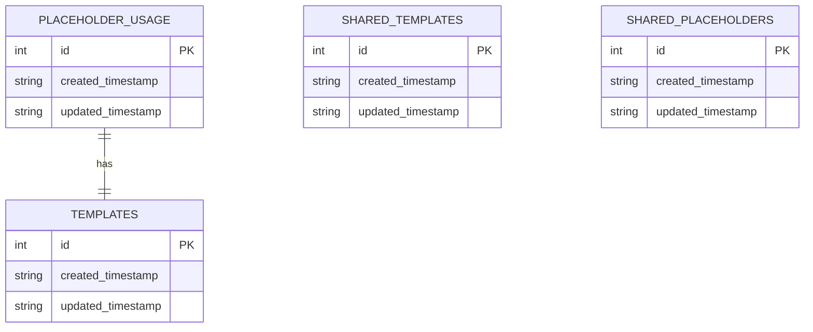

# Entity-Relationship Diagram: development.db

## Database Overview
- **Database Name**: development.db
- **Total Tables**: 4
- **Total Relationships**: 1
- **Generated**: 2025-07-03 05:53:03

## Table Definitions

### templates

```sql
CREATE TABLE templates (
                    id INTEGER PRIMARY KEY AUTOINCREMENT,
                    template_name TEXT UNIQUE NOT NULL,
                    template_content TEXT NOT NULL,
                    created_timestamp DATETIME DEFAULT CURRENT_TIMESTAMP,
                    updated_timestamp DATETIME DEFAULT CURRENT_TIMESTAMP,
                    is_active BOOLEAN DEFAULT 1
                )
```

### placeholder_usage

```sql
CREATE TABLE placeholder_usage (
                    id INTEGER PRIMARY KEY AUTOINCREMENT,
                    placeholder_name TEXT NOT NULL,
                    template_id INTEGER,
                    usage_count INTEGER DEFAULT 1,
                    last_used DATETIME DEFAULT CURRENT_TIMESTAMP,
                    FOREIGN KEY (template_id) REFERENCES templates(id)
                )
```

### shared_templates

```sql
CREATE TABLE shared_templates (
                        id INTEGER PRIMARY KEY AUTOINCREMENT,
                        template_id TEXT NOT NULL,
                        source_database TEXT NOT NULL,
                        template_content TEXT NOT NULL,
                        placeholder_mapping TEXT, -- JSON
                        sync_timestamp DATETIME DEFAULT CURRENT_TIMESTAMP,
                        sync_status TEXT DEFAULT 'active'
                    )
```

### shared_placeholders

```sql
CREATE TABLE shared_placeholders (
                        id INTEGER PRIMARY KEY AUTOINCREMENT,
                        placeholder_name TEXT NOT NULL,
                        placeholder_type TEXT NOT NULL,
                        category TEXT NOT NULL,
                        source_database TEXT DEFAULT 'learning_monitor',
                        local_override TEXT,
                        sync_timestamp DATETIME DEFAULT CURRENT_TIMESTAMP
                    )
```

## Relationships

| From Table | From Column | To Table | To Column |
|------------|-------------|----------|----------|
| placeholder_usage | template_id | templates | id |

## Mermaid ER Diagram



## Usage Guidelines

### Querying Guidelines
- Use appropriate indices for performance
- Consider transaction isolation levels
- Implement proper error handling

### Security Considerations
- Validate all inputs
- Use parameterized queries
- Implement access controls

### Performance Optimization
- Use connection pooling
- Implement caching where appropriate
- Monitor query performance
\n
## 🤖🤖 DUAL COPILOT PATTERN COMPLIANT
**Enterprise Standards:** This documentation follows DUAL COPILOT patterns with visual processing indicators and anti-recursion protocols.
