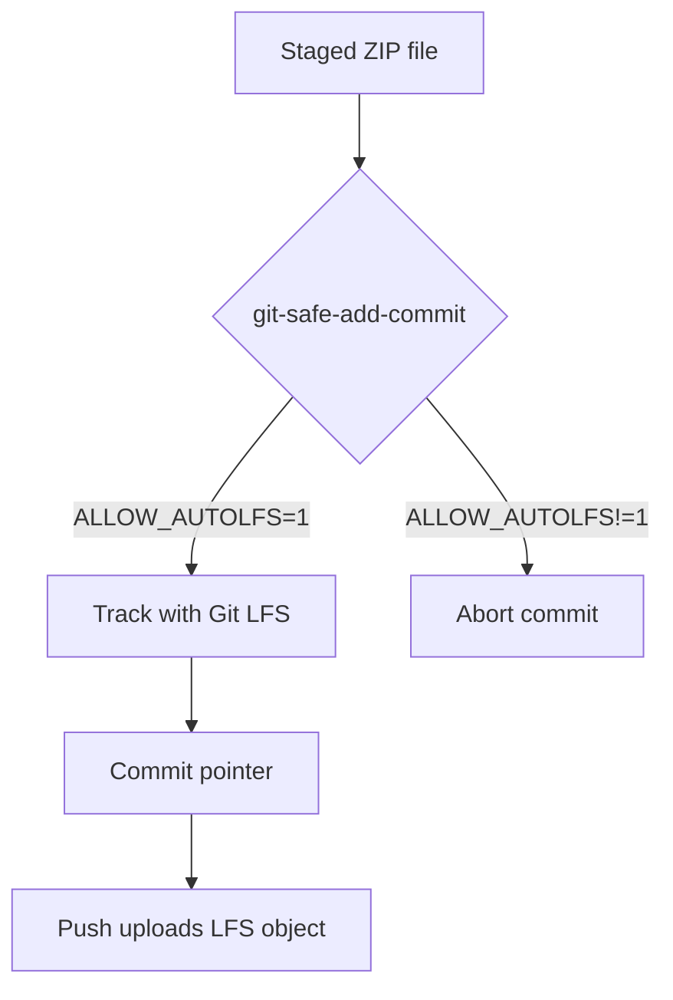

# Git LFS Workflow

This project uses **git-safe-add-commit** utilities to automatically track large or binary files with Git LFS.

## Workflow Diagram



## Python Utility

Run `tools/git_safe_add_commit.py` instead of `git commit` to scan staged files. When `ALLOW_AUTOLFS=1` is set, binary files or files larger than the configured threshold are automatically tracked using Git LFS. The script installs Git LFS if necessary, updates `.gitattributes`, and re-stages the files before committing. Use `-h/--help` to view all options.

```bash
ALLOW_AUTOLFS=1 tools/git_safe_add_commit.py -h
ALLOW_AUTOLFS=1 tools/git_safe_add_commit.py "your message" --push
```

## Bash Fallback

For minimal environments use `tools/git_safe_add_commit.sh` with the same behaviour. The commit is aborted if `ALLOW_AUTOLFS` is not `1` and an untracked binary or large file is detected. The shell script mirrors the Python version and also supports `-h/--help`.

```bash
export ALLOW_AUTOLFS=1
./tools/git_safe_add_commit.sh -h
./tools/git_safe_add_commit.sh "your message" --push
```

Both scripts read `.codex_lfs_policy.yaml` for the size limit and known binary extensions.
