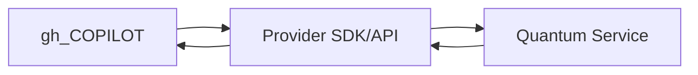

# Quantum Integration Guide

This guide outlines how to connect the gh_COPILOT platform with leading quantum service providers. It focuses on IBM Quantum, D-Wave, and IonQ and covers APIs, data formats, security, and hardware specifics.

## Integration Workflow Overview

Each provider follows this general flow: the platform builds a circuit or problem, submits it through the provider SDK or REST API, waits for job completion, and then retrieves results for analysis.

## Provider Details

### IBM Quantum
- **API**: Qiskit or IBM Quantum REST API (`https://api.quantum-computing.ibm.com`).
- **Authentication**: Requires an API token set via `QISKIT_IBM_TOKEN` environment variable.
- **Data Format**: Qiskit `QuantumCircuit` serialized to JSON when using REST. Measurement counts returned as JSON.
- **Security**: Use token-based auth over HTTPS; store tokens in secrets management, not in source control.

### D-Wave
- **API**: `dwave-system` Python client or REST (`https://cloud.dwavesys.com/sapi`).
- **Authentication**: Uses API token provided by D-Wave Leap; set via `DWAVE_API_TOKEN`.
- **Data Format**: Problems submitted as QUBO or Ising model in JSON; results returned with energy, spin states, and metadata.
- **Security**: Tokens scoped per project; transmit over TLS and rotate regularly.

### IonQ
- **API**: REST at `https://api.ionq.co/v0` or `qiskit-ionq` provider.
- **Authentication**: Bearer token supplied in `Authorization` header (`IONQ_API_KEY`).
- **Data Format**: Circuits expressed in QASM or via IonQ JSON schema; results contain measurement histograms.
- **Security**: Enforce HTTPS and least-privilege API keys; monitor job payload sizes.

## Hardware Specifications

| Provider | Hardware Type | Qubit Count* | Connectivity |
|---------|---------------|--------------|--------------|
| IBM Q   | Superconducting | 127+ (Eagle) | Heavy-hex lattice |
| D-Wave  | Quantum Annealer | 5000+ (Advantage) | Pegasus graph |
| IonQ    | Trapped Ion | 32 (Harmony) | All-to-all |

*Approximate qubit counts for commonly available systems; actual availability varies.

## Security Considerations

1. **Credential Management**: Store tokens in encrypted vaults or environment variables; never commit secrets.
2. **Transport Security**: All provider APIs require HTTPS; validate certificates and avoid downgrades.
3. **Data Privacy**: Review provider policies for data retention. Encrypt sensitive payloads before submission when required.

## Data Handling

- Normalize all results into a standard JSON schema within gh_COPILOT for downstream analytics.
- Validate payload sizes and job parameters against provider limits (e.g., circuit depth, number of shots).

## Peer Review

This document is submitted for team review. Please provide feedback via the standard pull request process. Revisions will incorporate peer suggestions and security guidance.

