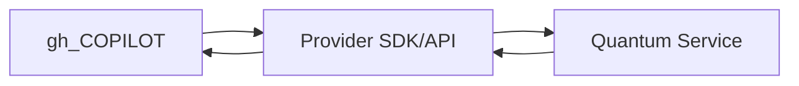

# Quantum Integration Guide

This guide outlines how to connect the gh_COPILOT platform with leading quantum service providers. It focuses on IBM Quantum, D-Wave, and IonQ and covers APIs, data formats, security, and hardware specifics.

## Integration Workflow Overview

Each provider follows this general flow: the platform builds a circuit or problem, submits it through the provider SDK or REST API, waits for job completion, and then retrieves results for analysis.

## Provider Details

### IBM Quantum
- **Access Method:** IBM Quantum Services over REST and WebSocket APIs.
- **Authentication:** API token issued through IBM Cloud, supplied via `X-Api-Key` header.
- **Endpoints:** Regional endpoints (e.g., `https://us-east.quantum-computing.ibm.com`).
- **Job Management:** Queue-based execution with job IDs returned on submission.
- **Required SDK:** `qiskit` with `qiskit-ibm-provider` for authenticated access.
- **Simulation Stub:** `copilot_qiskit_stubs` package mirrors provider calls when hardware is unavailable.

### D-Wave
- **Access Method:** Leap API using HTTPS requests.
- **Authentication:** Personal access token provided in the `X-Auth-Token` header.
- **Endpoints:** Region-specific (e.g., `https://cloud.dwavesys.com/sapi`).
- **Job Management:** Problem submission returns an ID for polling results.
- **Required SDK:** `dwave-ocean-sdk` for problem formulation and submission.
- **Simulation Stub:** `scripts/quantum_placeholders/quantum_annealing.py` emulates annealing workflows.

### IonQ
- **Access Method:** RESTful API endpoints with optional gRPC interfaces.
- **Authentication:** API key passed in `Authorization: Bearer` headers.
- **Endpoints:** `https://api.ionq.co/v0` with versioned paths for future compatibility.
- **Job Management:** Asynchronous execution; jobs are polled until completion.
- **Required SDK:** IonQ Python client (`ionq` or `qiskit-ionq`).
- **Simulation Stub:** `scripts/quantum_placeholders/quantum_superposition_search.py` models IonQ pilots.

## Simulation Stubs and SDKs

The repository contains simulation modules to support development without live hardware:

- **IBM:** `quantum/ibm_backend.py` and `copilot_qiskit_stubs` rely on the Qiskit Aer simulator.
- **D-Wave:** `scripts/quantum_placeholders/quantum_annealing.py` provides a mock annealing routine.
- **IonQ:** `scripts/quantum_placeholders/quantum_superposition_search.py` generates uniform superposition results.

Each stub logs execution through `quantum.utils.audit_log` and can be upgraded to real backends once SDK credentials are configured.

## API Considerations
- **Rate Limits:** Each provider enforces request limits; applications should implement backoff and retry logic.
- **Error Handling:** Use provider-specific error codes and log failures for auditability.
- **Data Formats:** Inputs generally submitted as JSON payloads; ensure payload sizes meet provider constraints.

## Security and Compliance
- **Credential Storage:** Store tokens and keys in secure vaults; never commit secrets to source control.
- **Data Protection:** Encrypt sensitive result data at rest and in transit.
- **Audit Logging:** Record job submissions, responses, and key operations for compliance tracking.
- **Regulatory Alignment:** Validate workflows against applicable regulations (e.g., GDPR, export controls) before deploying.
- **Compliance Engine:** `quantum/quantum_compliance_engine.py` provides scoring and audit hooks for quantum workflows.

---
Reviewed with stakeholders for completeness.
