# Advanced Template Intelligence Platform - Entity Relationship Diagrams

## Master Database Schema Overview

```mermaid
erDiagram
    LEARNING_MONITOR ||--o{ TEMPLATE_PATTERNS : tracks
    LEARNING_MONITOR ||--o{ PLACEHOLDER_INTELLIGENCE : manages
    LEARNING_MONITOR ||--o{ TEMPLATE_VERSIONING : versions
    LEARNING_MONITOR ||--o{ CROSS_DATABASE_REFERENCES : references
    
    PRODUCTION ||--o{ CONFIG_TEMPLATES : stores
    PRODUCTION ||--o{ DEPLOYMENT_CONFIGS : maintains
    
    ANALYTICS_COLLECTOR ||--o{ USAGE_PATTERNS : collects
    ANALYTICS_COLLECTOR ||--o{ PERFORMANCE_METRICS : gathers
    
    PERFORMANCE_ANALYSIS ||--o{ OPTIMIZATION_RESULTS : produces
    PERFORMANCE_ANALYSIS ||--o{ SCALING_RECOMMENDATIONS : generates
    
    FACTORY_DEPLOYMENT ||--o{ DEPLOYMENT_TEMPLATES : creates
    FACTORY_DEPLOYMENT ||--o{ AUTOMATION_SCRIPTS : manages
    
    CAPABILITY_SCALER ||--o{ SCALING_PATTERNS : identifies
    CAPABILITY_SCALER ||--o{ RESOURCE_ALLOCATIONS : optimizes
    
    CONTINUOUS_INNOVATION ||--o{ INNOVATION_PATTERNS : discovers
    CONTINUOUS_INNOVATION ||--o{ IMPROVEMENT_SUGGESTIONS : suggests
    
    SCALING_INNOVATION ||--o{ SCALING_STRATEGIES : develops
    SCALING_INNOVATION ||--o{ GROWTH_PATTERNS : analyzes

    LEARNING_MONITOR {
        int id PK
        string session_id UK
        timestamp created_at
        json learning_data
        string status
    }
    
    TEMPLATE_PATTERNS {
        int id PK
        string pattern_id UK
        string pattern_type
        json pattern_data
        float confidence_score
        timestamp discovered_at
    }
    
    PLACEHOLDER_INTELLIGENCE {
        int id PK
        string placeholder_name UK
        string placeholder_category
        int usage_frequency
        json context_patterns
        json value_patterns
        string validation_regex
        string default_value
        boolean environment_specific
        string security_level
        json transformation_rules
        json related_placeholders
        float quality_score
        timestamp last_updated
    }
    
    TEMPLATE_VERSIONING {
        int id PK
        string template_id
        string version_number
        string change_type
        json placeholder_changes
        string compatibility_level
        timestamp created_date
        string created_by
        string approval_status
        json rollback_data
    }
    
    CROSS_DATABASE_REFERENCES {
        int id PK
        string source_database
        string source_table
        string source_id
        string target_database
        string target_table
        string target_id
        string relationship_type
        timestamp created_at
        json metadata
    }
    
    ENVIRONMENT_PROFILES {
        int id PK
        string profile_id UK
        string profile_name
        string environment_type
        json characteristics
        json adaptation_rules
        json template_preferences
        int priority
        boolean active
        timestamp created_timestamp
        timestamp modified_timestamp
    }
    
    ADAPTATION_RULES {
        int id PK
        string rule_id UK
        string rule_name
        string environment_context
        json condition_pattern
        string adaptation_action
        json template_modifications
        float confidence_threshold
        int execution_priority
        boolean active
        timestamp created_timestamp
    }
```



## Detailed Database Schemas

### Learning Monitor Database
The central intelligence hub that coordinates all template learning and adaptation activities.

**Key Tables:**
- `learning_patterns`: Core learning algorithm data
- `template_intelligence`: Smart template management
- `placeholder_intelligence`: Advanced placeholder system
- `template_versioning`: Version control and compatibility
- `cross_database_references`: Inter-database relationships
- `enterprise_compliance_audit`: Security and compliance tracking
- `intelligent_migration_log`: Migration tracking and rollback

### Production Database
Production-ready configurations and templates optimized for live environments.

**Key Tables:**
- `config_templates`: Production configuration templates
- `deployment_configs`: Deployment-specific configurations
- `security_policies`: Production security policies
- `performance_baselines`: Performance benchmarks

### Analytics Collector Database
Comprehensive analytics and usage pattern collection.

**Key Tables:**
- `usage_patterns`: User interaction patterns
- `performance_metrics`: System performance data
- `error_analytics`: Error pattern analysis
- `feature_usage`: Feature adoption metrics

### Performance Analysis Database
Advanced performance analysis and optimization recommendations.

**Key Tables:**
- `optimization_results`: Performance optimization outcomes
- `scaling_recommendations`: Auto-scaling suggestions
- `resource_utilization`: Resource usage patterns
- `performance_baselines`: Performance benchmarks

## Cross-Database Relationship Patterns

### Template Sharing Flow
```
Learning Monitor → Analytics Collector → Performance Analysis → Production
    ↓                    ↓                      ↓                ↓
Template Discovery → Usage Analysis → Performance Tuning → Production Deployment
```

### Innovation Pipeline
```
Continuous Innovation → Learning Monitor → Factory Deployment → Scaling Innovation
       ↓                     ↓                   ↓                    ↓
Innovation Ideas → Pattern Recognition → Automated Deployment → Scale Optimization
```

### Quality Assurance Flow
```
All Databases → Enterprise Compliance Audit → Validation → Approval → Production
```

## Placeholder Intelligence System

### Placeholder Categories
1. **Database Configuration**: `{{DATABASE_*}}`
2. **API Configuration**: `{{API_*}}`
3. **Security Settings**: `{{SECURITY_*}}`
4. **Cloud Resources**: `{{CLOUD_*}}`
5. **Monitoring**: `{{MONITORING_*}}`
6. **Performance**: `{{PERFORMANCE_*}}`
7. **Environment**: `{{ENV_*}}`
8. **Business Logic**: `{{BUSINESS_*}}`

### Security Levels
- **PUBLIC**: General configuration values
- **INTERNAL**: Internal system settings
- **CONFIDENTIAL**: API keys and tokens
- **SECRET**: Passwords and private keys

### Transformation Rules
- Environment-specific value substitution
- Security-level appropriate obfuscation
- Performance-optimized value selection
- Context-aware default value assignment

